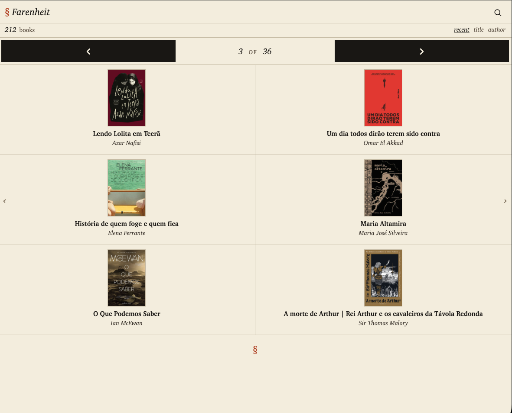
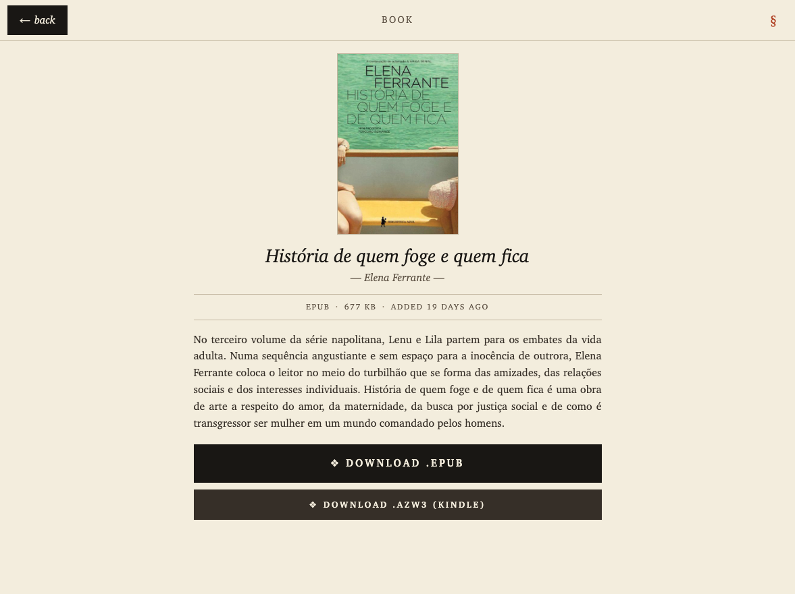

# Farenheit

A tiny, self-hosted catalog that serves your epub library to an e-reader's built-in web browser. Watches a local folder, builds a list, and lets you tap through pages on a Kobo / Kindle / Boox / reMarkable without any cable, account, or cloud middleware.

Optimized for the real-world constraints of e-ink displays: zero-JS markup, paginated views (no infinite scroll), large tap targets, solid-filled buttons, and a typographic layout that renders cleanly on old WebKit-based browsers.

> Farenheit is a deliberate nod to Bradbury's *Fahrenheit 451* — the temperature at which paper burns, now reclaimed as the temperature at which books reach you.

## Screenshots

**Home — book grid, 2 columns × 3 rows per page.** Built to fit a 6" e-reader viewport without scrolling, identical layout on desktop and the Kobo Clara Color / Kindle / Boox built-in browsers (no media queries — the markup uses only what old WebKit can render reliably).



The § in the top-left and again at the page foot is a deliberate typographic echo (section sign as "end of section" — opens and closes the page). The faint chevrons `‹ ›` floating on the side margins are invisible-ish tap zones: tap there and the page advances without needing to find the dark pager buttons up top.

**Book detail — cover, description, format buttons.**



The back button preserves the listing's page and sort, so going `home page 3 → book → back` returns to page 3, not page 1. Two download options: `.epub` (any reader) and `.azw3` (Kindle's native sideload format — produced via Calibre, covers index reliably in the device library).

The CLI gives a live read of what's happening:

```
$ farenheit stats

  FARENHEIT · stats                          2026-05-11 22:23Z
  ────────────────────────────────────────────────────────────────
  db: /Users/you/.../data/farenheit.sqlite

  library
    books             212        on disk 212   unsynced 0
    total size        655.8 MB   avg/book 3.1 MB
    largest           93.8 MB  "Palestina"
    newest            "Livro - TAG Inéditos" · added 19h ago
    added (30d)       212

  downloads
    total             58         today 3   7d 8   30d 58
    unique books      19 / 212   (9% do catálogo)
    never baixados    193
    last download     2h ago

    top 10 mais baixados
       1.   11×  "The Egg" — Andy Weir
       2.    8×  "Admirável Mundo Novo" — Huxley, Aldous
       3.    6×  "Lendo Lolita em Teerã" — Azar Nafisi
       …

    últimos 20 baixados
       1.  2h ago      "Maria Altamira" — Maria José Silveira  · 1acb4593…
       2.  4h ago      "Fúria Vermelha" — Pierce Brown        · 75274ed7…
       …
```

For deeper analytics — per-book consensus, per-device picks, recent timeline — see the [Analytics dashboard](#analytics-dashboard).

## Features

- **Auto-sync** — drop an `.epub` into your watched folder (e.g. iCloud Drive `Books`) and it shows up automatically; remove it and it disappears.
- **Covers** — extracted from each epub, resized to WebKit-safe JPEG (≤ 400 px wide).
- **Library catalog UI** — warm paper aesthetic, serif typography, solid dark buttons, per-page navigation with ← / → chevrons. 6 books per page by default.
- **Sort** by recently added, title, or author. Alphabet jump strip skips straight to the page where a letter starts.
- **Per-device download tracking** — each e-reader gets a cookie UUID; downloaded books are visibly marked so you don't re-download what's already on the device.
- **iCloud-aware** — detects dataless placeholders (files in iCloud but not yet materialized locally), marks them in the UI with a retry action that invokes `brctl download`.
- **Kindle-friendly `.azw3` export** — if the [Calibre](https://calibre-ebook.com) desktop app is installed, a secondary "Download .azw3" button appears on the detail page and converts on demand (cached per book). AZW3 is Amazon's native sideload format on modern Kindles, which makes covers index reliably in the device library and avoids the "is this a purchased item?" warnings KF8-in-MOBI sometimes triggers. Title, author, publisher, description, and cover image are preserved in the output.
- **OPDS catalog** at `/opds` — point any OPDS reader (KOReader, the Xteink/Onyx built-in reader, Aldiko, Marvin, …) at `http://<your-mac>:1111/opds` and browse Recent / Alphabetical / By Author. Acquisition links for both EPUB and AZW3 when Calibre is available. See [OPDS catalog](#opds-catalog) below for the full setup.
- **LAN only** — no external dependencies. No account. No server round trip beyond your own Mac.

## How it compares to alternatives

| | Farenheit | Calibre Web | `send.djazz.se` |
|---|---|---|---|
| Auto-sync from a folder | ✅ | ❌ (manual upload) | ❌ (one-at-a-time) |
| Works offline / LAN-only | ✅ | ✅ | ❌ (needs Rakuten) |
| E-ink optimized UI | ✅ | ⚠️ generic | N/A |
| Setup complexity | one command | medium | none (but limited) |

## Requirements

- **macOS** — the iCloud-placeholder detection uses `brctl`, which is macOS-specific.
- **[Bun](https://bun.sh)** — a fast JS runtime used for the server. Install with:
  ```bash
  curl -fsSL https://bun.sh/install | bash
  ```
- A folder of `.epub` files, anywhere on disk. iCloud Drive works; a plain local folder works too.

## Quick start

```bash
git clone https://github.com/<you>/farenheit.git
cd farenheit

# Point at your books folder (any absolute path)
BOOKS_DIR="$HOME/Library/Mobile Documents/com~apple~CloudDocs/Books" \
  ./bin/farenheit install
```

`install` will:

1. Run `bun install` to grab dependencies.
2. Generate a launchd agent that auto-starts the server on login and restarts on crash.
3. Symlink `farenheit` onto your `$PATH` (in `~/.local/bin` or `/usr/local/bin`, whichever is writable).
4. Start the service and print the LAN URL.

> **Full Disk Access** — on macOS Sonoma and later, the launchd agent needs Full Disk Access to read files inside `~/Library/Mobile Documents/`. If you see `EDEADLK` errors in `data/farenheit.log`, open **System Settings → Privacy & Security → Full Disk Access**, click **+**, and add `~/.bun/bin/bun`.

## Daily usage

Once installed, the `farenheit` CLI handles the whole service lifecycle:

```bash
farenheit url          # print the LAN URL, handy to copy to the e-reader
farenheit status       # service state, current URL, last log lines
farenheit logs -f      # tail -f the log
farenheit stats        # library + downloads + per-device analytics
farenheit prune        # delete ghost device rows (use --dry-run to preview)
farenheit open         # open the UI in your Mac browser
farenheit restart      # bounce after config or code changes
farenheit stop         # stop the service
farenheit start        # start it again
farenheit uninstall    # remove the launchd agent and the CLI symlink
```

## Accessing from the e-reader

1. Put the Mac and the e-reader on the same Wi-Fi network.
2. Copy the LAN URL:
   ```bash
   farenheit url
   # → http://192.168.1.42:1111
   ```
3. On the e-reader, either open the web UI or wire up the OPDS feed:

   **Web browser** (Kobo / Kindle / any built-in browser):
   - **Kobo:** `More → Settings → Beta Features → Web Browser`
   - **Kindle:** `Menu → Experimental → Web Browser` (older models only)
   - Enter the LAN URL. Bookmark it.

   **OPDS reader** (Xteink / KOReader / Aldiko / Marvin / etc.):
   - Add a new OPDS catalog with URL `http://<lan-ip>:1111/opds`.
   - The reader will list every book on disk with covers, descriptions,
     and download links for `.epub` (and `.azw3` when Calibre is installed).

4. Tap a book → **Download** → the file is saved to the device library.

## OPDS catalog

[OPDS](https://opds.io) (Open Publication Distribution System) is the de-facto Atom-based protocol that nearly every dedicated e-reader app speaks: KOReader, Aldiko, Marvin, Moon+ Reader, the Xteink/Onyx built-in reader, and many more. It gives you a clean catalog UI inside your reading app instead of going through the web browser.

### Setup (one URL)

In your reader app, find "Add OPDS catalog" (label varies — "Add catalog", "Add network library", "Add server"). Paste:

```
http://<lan-ip>:1111/opds
```

That's it. The reader will fetch the navigation feed and show you what's available.

### Catalog structure

Farenheit serves a small navigation tree, mirroring what calibre-web does so strict OPDS clients accept it without complaints:

```
/opds                       navigation root (3 sub-feeds)
  ├─ /opds/recent           top 30 most recently added
  ├─ /opds/alphabetical     all books sorted by title (paginated, 30/page)
  └─ /opds/authors          author index → /opds/author/<name>
/opds/search?q=<term>       full-text search across title + author
/opds/osd                   OpenSearch description (clients fetch this on connect)
```

Each book entry carries:

- Title, author, last-updated timestamp
- Cover and thumbnail (`<link rel="…/image">`, `<link rel="…/image/thumbnail">`)
- Description from the epub metadata, when available, as `<content type="xhtml">`
- Acquisition links for `.epub` (always) and `.azw3` (if [Calibre](https://calibre-ebook.com) is installed) — sized with explicit `length="…"` so clients can pre-validate before downloading

### Tested clients

| Reader | Status |
|---|---|
| Xteink / Onyx Boox built-in OPDS reader | ✅ |
| KOReader | ✅ |
| Aldiko / Moon+ Reader (Android) | ✅ |
| Marvin (iOS) | should work — same endpoints calibre-web speaks |

### Authentication (optional)

If you set `FARENHEIT_USER` / `FARENHEIT_PASS` (see [Configuration](#configuration)), OPDS clients prompt for credentials the first time and store them. For clients that don't have a credentials field, paste the URL with embedded auth:

```
http://<user>:<pass>@<lan-ip>:1111/opds
```

LAN access keeps working without auth — the auth check only kicks in for tunneled / remote requests.

### Diagnostics

- `http://<lan-ip>:1111/opds/test` — minimal hardcoded acquisition feed with a single dummy entry. If the real `/opds` fails to parse on a device but `/opds/test` works, the issue is in real-book metadata; open an issue with the failing book's title.

## Configuration

Environment variables (all optional except `BOOKS_DIR`):

| Variable | Default | Description |
|---|---|---|
| `BOOKS_DIR` | *required* | Absolute path to the folder containing your `.epub` files. Subfolders become categories. |
| `PORT` | `1111` | HTTP port. |
| `HOST` | `0.0.0.0` | Bind address. Leave as-is for LAN access. |
| `DATA_DIR` | `./data` | Where the SQLite index, cover thumbnails, AZW3 cache, and log live. |
| `EBOOK_CONVERT` | *(auto-detect)* | Override path to Calibre's `ebook-convert`. By default Farenheit looks in `/Applications/calibre.app/Contents/MacOS/` and common Homebrew prefixes. Leave empty to disable the AZW3 export button. |
| `FARENHEIT_USER` | *(unset)* | When set together with `FARENHEIT_PASS`, requires authentication for any request from a non-LAN (non-private) IP. Browsers see an HTML login page (`/login`) that sets a 30-day cookie; OPDS readers and CLI clients can use HTTP Basic Auth instead. Requests from RFC 1918 private IPs (your home Wi-Fi) bypass auth entirely. |
| `FARENHEIT_PASS` | *(unset)* | Companion to `FARENHEIT_USER`. A typable passphrase (e.g. `papel-tijolo-fogo-cinza`) is friendlier on touchscreen keyboards than `openssl rand -base64 24` output, and just as strong at 16+ chars. |

See [`.env.example`](.env.example) for a copy-pasteable template.

To change any of these after install, edit `~/Library/LaunchAgents/com.farenheit.plist` and run `farenheit restart`.

## Public access via Tailscale Funnel

Want to reach your library from outside your home Wi-Fi (a Kindle in a hotel, a Kobo at a friend's place, etc.) without opening ports on your router, paying for a domain, or moving your books to the cloud? Expose Farenheit through [Tailscale Funnel](https://tailscale.com/kb/1223/funnel/). Books stay on your Mac, the connection is HTTPS-terminated by Tailscale's edge with a real Let's Encrypt cert, and the login page keeps strangers out.

### Why Funnel over a self-hosted tunnel

- **No router changes** — no port forwarding, no NAT traversal, no dynamic DNS.
- **No domain to buy** — you get a stable `https://<machine>.<tailnet>.ts.net` for free, with auto-renewing TLS.
- **Free for personal use** — Tailscale's free tier covers up to 100 devices.
- **Survives reboots** — `tailscaled` is a launchd service itself; the funnel re-establishes automatically when the Mac comes back up.

### One-time setup

1. **Install Tailscale on your Mac:**
   ```bash
   brew install --cask tailscale
   ```
   Open the Tailscale app and sign in (Google / GitHub / Microsoft / passkey — whatever you prefer).

2. **(Recommended) Rename the machine in the [Tailscale admin console](https://login.tailscale.com/admin/machines)** to something like `farenheit`. The Funnel URL will use this name: `https://farenheit.<your-tailnet>.ts.net`. Otherwise it inherits whatever your Mac's hostname is.

3. **Enable Funnel for your tailnet** — open **Access controls → Funnel** in the admin console and turn it on (off by default for new accounts).

4. **(Optional but strongly recommended) Set credentials** — install or reinstall with auth:
   ```bash
   FARENHEIT_USER=you \
   FARENHEIT_PASS="papel-tijolo-fogo-cinza" \
   ./bin/farenheit install
   ```
   Funnel is *publicly* reachable — without `FARENHEIT_USER`/`FARENHEIT_PASS`, anyone with the URL can browse and download your library. Pick a typable passphrase (16+ chars) that you can actually enter on a Kindle keyboard.

5. **Turn on the funnel:**
   ```bash
   tailscale funnel --bg 1111
   ```
   Output:
   ```
   Available on the internet:
     https://farenheit.<your-tailnet>.ts.net/
   ```
   Copy that URL to your e-reader — bookmark it, log in once, the cookie persists 30 days.

6. **Verify from outside the LAN** (phone on cellular, friend's network):
   ```bash
   curl -I https://farenheit.<your-tailnet>.ts.net/login
   # → HTTP/2 200
   ```

LAN access (`http://<lan-ip>:1111/`) keeps working without auth — the auth gate only kicks in for non-private source IPs.

### Caveats

- **Your Mac must stay awake.** Set **System Settings → Battery → Prevent automatic sleeping**. Closing the laptop lid still sleeps the Mac on most MacBooks unless you're running clamshell mode (external display + AC + keyboard), or override with `sudo pmset -a disablesleep 1`.
- **Dependency on Tailscale as a company.** Free tier is generous today, but they own the public hostname. If they kill the free tier you'd need to migrate. For a personal library this is an acceptable trade.
- **Sharing copyrighted books over a public URL is your responsibility.** Auth + a hard-to-guess machine name mitigate exposure but don't eliminate it.

### Troubleshooting

**Public URL stops responding but LAN works**

The funnel binding can drift into a zombie state — `tailscale funnel status` reports it as "on" but TLS handshakes from outside fail (`SSL_ERROR_SYSCALL` or connection timeouts). LAN access still works because it bypasses the funnel. Full reset:

```bash
tailscale funnel reset
tailscale serve reset       # Funnel sits on top of Serve — reset both
tailscale funnel --bg 1111
```

The `serve reset` is the load-bearing one. `funnel reset` alone sometimes leaves a stale Serve binding behind, and the new Funnel inherits the bad state. Resetting both forces a clean re-registration with Tailscale's edge nodes.

Verify with both public ingress IPs (DNS round-robins between them, so a flaky binding affects ~50% of incoming requests):

```bash
for ip in $(dig +short farenheit.<your-tailnet>.ts.net @8.8.8.8); do
  curl -sS -o /dev/null -w "$ip → %{http_code} %{time_total}s\n" \
    --resolve "farenheit.<your-tailnet>.ts.net:443:$ip" \
    https://farenheit.<your-tailnet>.ts.net/login
done
```

Both should return `200`. If one is 200 and the other times out, repeat the reset.

**iOS Safari shows "Cannot connect to server"**

The Tailscale iOS app can intercept DNS for `.ts.net` even when "disconnected" if the VPN profile remains. Try in this order:

1. Open the Tailscale app and connect — *or* fully kill it from the app switcher.
2. Disable iCloud Private Relay (`Settings → Apple ID → iCloud → Private Relay`).
3. Try cellular instead of Wi-Fi — some captive networks block uncommon TLDs.
4. Open in Safari Private Browsing to bypass cached state.

**Confirm whether the issue is the server or the funnel**

```bash
curl -I http://localhost:1111/login                                                   # local server alive?
curl -I --resolve farenheit.<tailnet>.ts.net:443:<ingress-ip> https://farenheit.<tailnet>.ts.net/login   # funnel ingress alive?
```

Tailscale's public ingress IPs change occasionally — get them from `dig farenheit.<your-tailnet>.ts.net @8.8.8.8 +short`.

## Development

```bash
bun install
bun tests/fixtures/build.ts    # one-time: build epub test fixtures

# Run the server directly (no launchd)
BOOKS_DIR="$HOME/Books" bun run src/index.ts

# Tests (73 across unit / integration / e2e)
bun test
```

### Project layout

```
bin/              # farenheit CLI (shell script)
src/
  indexer/        # folder scan + epub parser + cover extraction + iCloud watcher
  store/          # SQLite persistence
  server/         # Bun.serve routes + HTML templates
tests/            # unit · integration · e2e
launchd/          # macOS user agent plist template + install script
data/             # runtime — SQLite, covers, log (gitignored)
```

The HTML templates deliberately avoid flexbox, grid, and modern CSS — the Kobo browser is a very old WebKit that ignores anything newer than ~2015. Layouts use HTML tables for multi-column alignment, floats for image-plus-text rows, and `position: static` everywhere.

## License

[MIT](LICENSE)
